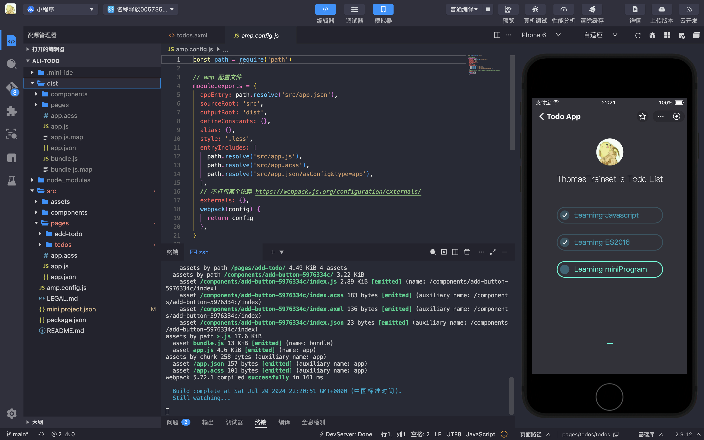
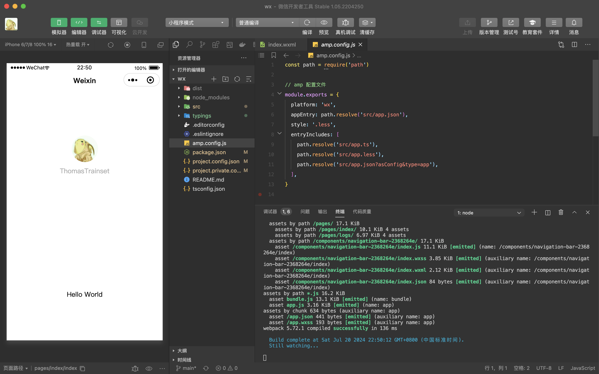

# AMP 小程序打包框架

支付宝小程序采用云构建方案，原生支付宝如果依赖了三方包，在上传时会把 node_modules 也上传上去，node_modules 越大，上传速度越慢。这个机制太傻了。

本项目是个人尝试编译打包小程序项目，不具备生产使用能力。
借鉴滴滴 MPX 框架，功能上支持原生小程序、TypeScript 编译、Less、Sass 等编译能力
只实现了打包依赖，DEV 开发，效果还算可以。

## 效果

1. 支付宝 TODO 小程序

2. 微信 TypeScript/Less 模板小程序

